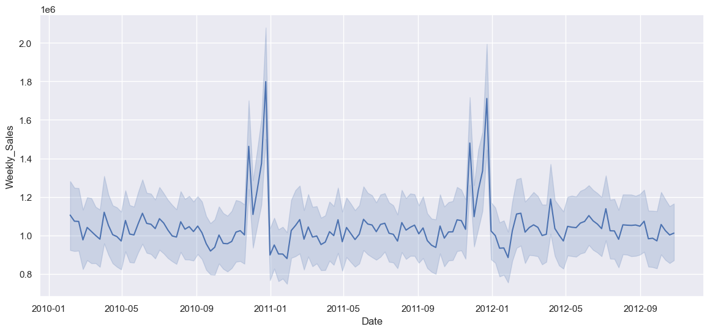

# 📈 Sales Trend & Factor Effectiveness Analysis

This project aims to analyze weekly sales trends and evaluate the impact of external factors such as holidays, fuel prices, CPI (Consumer Price Index), and temperature on sales volume. The analysis is conducted using Python and includes data preprocessing, visualization, and statistical modeling.

---

## 🛠 Tools & Technologies

- Python
- pandas
- matplotlib
- seaborn
- statsmodels
- Jupyter Notebook

---

## 🎯 Objective

To discover how key external factors influence sales trends and provide insights for better business planning and promotional timing.

---

## 📌 Key Responsibilities

- ✅ Cleaned and transformed raw sales data using `pandas`, including handling missing values and detecting outliers.
- 📊 Visualized weekly sales patterns, decomposed trends and seasonality using time series techniques.
- 📈 Conducted correlation and OLS regression analysis with `statsmodels` to measure the impact of each factor.
- 🔍 Identified statistically significant variables such as holiday effects and CPI.
- 🖼 Created clear and informative visualizations using `matplotlib` and `seaborn`.

---

## 📊 Key Results

- Gained actionable insights into which factors most affect sales.
- Helped support data-driven business decisions and promotional strategy planning.

---
## Result

## 📎 Contact  
Nattachot Puttitanachot | [LinkedIn](www.linkedin.com/in/nattachot-puttitanachot-356b2b269) 

> 🔗 This project is part of my Data Analyst portfolio.

